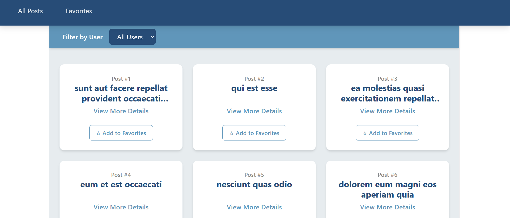
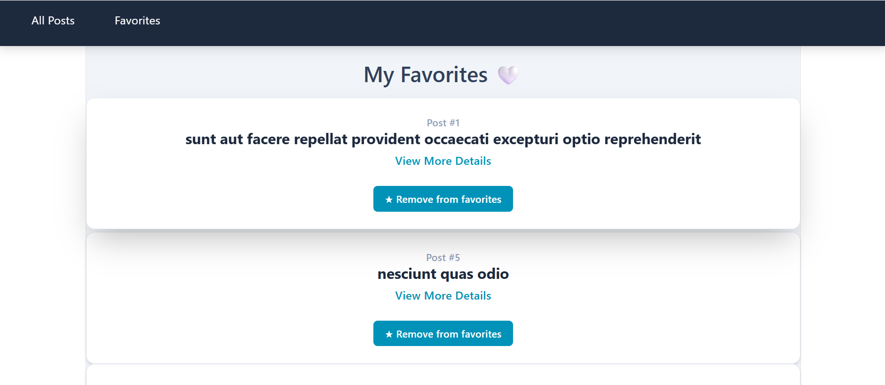
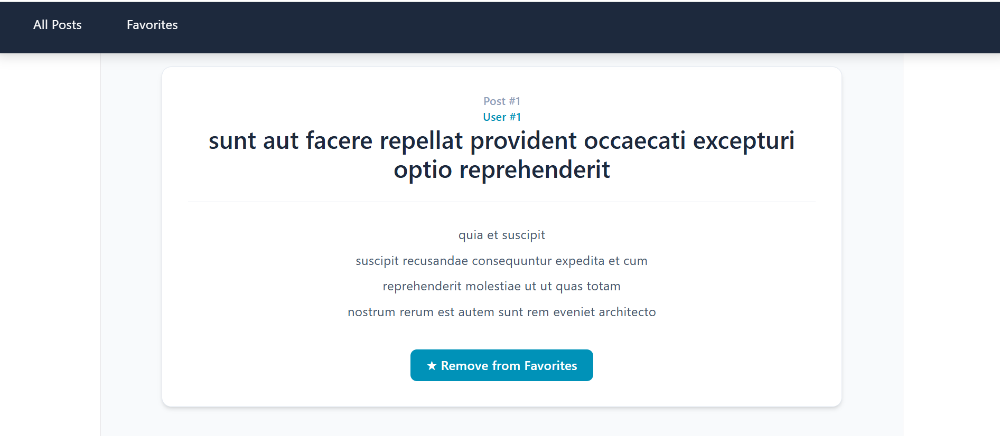

# React Posts App

## 📌 Overview

This project is a React application that displays posts from an external API (JSONPlaceholder).  
Users can browse posts, filter them by user ID, view detailed information for each post, and manage a favorites list.  
Favorites are saved in localStorage so they remain even after page refresh.

---

## 🚀 Features

- Fetch posts from external API (JSONPlaceholder)
- Display posts in a responsive grid layout
- Filter posts by User ID
- View full details for each post
- Add / remove posts from favorites
- Favorites page to view saved posts
- Persistent favorites using localStorage
- React Router navigation between pages
- Responsive UI using Tailwind CSS

---

## 🛠️ Technologies Used

- React (Hooks: useState, useEffect)
- React Router DOM
- Axios
- Tailwind CSS
- LocalStorage API
- Vite

---

## 📁 Project Structure

```text
src/
├── components/
│   └── Api.jsx
├── pages/
│   ├── HomePage.jsx
│   ├── FavoritesPage.jsx
│   └── DetailsPage.jsx
├── services/
│   └── loadingPosts.js
├── tests/
│   ├── favorites.test.jsx
│   └── filter.test.jsx
├── utils/
│   ├── favorites.js
│   └── filter.js
├── App.jsx
└── main.jsx
```

## 🔄 How It Works

- On load, the app fetches posts from:
  https://jsonplaceholder.typicode.com/posts

- Posts are stored in state

- Users can:
  - Filter posts by user ID
  - Open post details
  - Add/remove favorites

- Favorites are saved in localStorage and restored on refresh

---

## ⭐ Favorites System

- Click button to add/remove a post from favorites
- Favorites are stored in localStorage
- Favorites persist after refresh

---

## 📄 Pages

### Home Page

- Displays all posts
- Filter by user ID
- Grid layout of post cards

### Favorites Page

- Displays only saved favorite posts

### Details Page

- Shows full post content
- Add/remove favorite button

---

## 🎨 UI Design

- Built with Tailwind CSS
- Fixed navigation bar
- Clean card-based layout
- Hover effects and transitions
- Fully responsive (mobile & desktop)

---

## ▶️ How to Run the Project

```bash
npm install
npm run dev
```

---

## 🧪 Running Tests

Run all unit tests:

```bash
npx vitest
```

Or run the tests once without watch mode:

```bash
npx vitest run
```

## 📸 Screenshots

### Home Page



### Favorites Page



### Details Page


