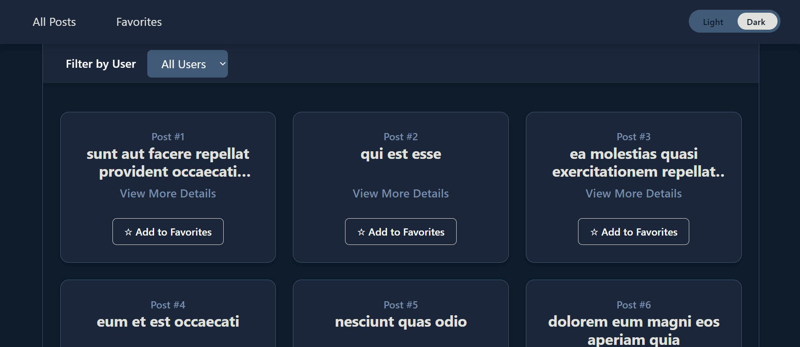

# React Posts App

A responsive React application for browsing, filtering, viewing, and managing posts from the JSONPlaceholder API.

## Demo

### Home Page


### Favorites Page


### Details Page


### Home Page - Dark Mode



## Features

- Fetch and display posts from the JSONPlaceholder API
- Filter posts by **User ID**
- View detailed information for each post
- Add and remove posts from **Favorites**
- Persist Favorites using `localStorage`
- Light and dark mode
- Loading skeletons and empty states
- User-friendly error messages and retry functionality
- React Error Boundary for unexpected rendering errors
- Responsive design and smooth UI animations

## Tech Stack

**React**, **Vite**, **React Router DOM**, **Axios**, **Tailwind CSS**, **Framer Motion**, **Vitest**, **React Testing Library**, **LocalStorage API**

## Architecture

The application is divided into reusable components, pages, custom hooks, services, utilities, and tests.

The `pages` handle the main application views, while reusable UI elements are located in `components`. The custom `useFetch` hook manages API requests, loading states, errors, and retry functionality. API-related logic is separated into `services`, reusable functions are located in `utils`, and automated tests are organized in `tests`.

## Getting Started

### Prerequisites

- **Node.js 18+**
- **npm**

### Installation

```bash
git clone https://github.com/maayan-sch/Api-React
cd Api-React
npm install
```

### Running Tests

```bash
npx vitest run
```

To run tests in watch mode:

```bash
npx vitest
```

### Running the Application

```bash
npm run dev
```

The application will be available at the local URL shown in the terminal.

## API / Usage

The application fetches posts from the JSONPlaceholder `/posts` endpoint and displays them in a responsive card-based interface.

Users can filter posts by **User ID**, open a post to view its details, and add posts to **Favorites**. Favorite posts are stored in `localStorage` and remain available after refreshing the page.

## Project Structure

```text
Api-React/
│
├── src/
│   │
│   ├── components/
│   │   ├── ErrorBoundary.jsx
│   │   └── PostCard.jsx
│   │
│   ├── hooks/
│   │   └── useFetch.jsx
│   │
│   ├── pages/
│   │   ├── HomePage.jsx
│   │   ├── FavoritesPage.jsx
│   │   └── DetailsPage.jsx
│   │
│   ├── services/
│   │   └── loadingPosts.jsx
│   │
│   ├── tests/
│   │   ├── favorites.test.jsx
│   │   ├── filter.test.jsx
│   │   └── useFetch.test.jsx
│   │
│   ├── utils/
│   │   ├── favorites.jsx
│   │   ├── filter.jsx
│   │   └── ErrorMessage.jsx
│   │
│   ├── App.jsx
│   └── main.jsx
│
├── screenshots/
│   ├── home.png
│   ├── favorites.png
│   ├── details.png
│   └── homeDarkMode.png
│
├── package.json
├── vite.config.js
└── README.md
```

## What I Learned

I learned how to build a reusable `useFetch` hook for managing asynchronous API requests, including loading, error, retry, and request cancellation.

I also practiced testing custom hooks and reusable functionality with **Vitest** and **React Testing Library**, while managing persistent client-side state with `localStorage`.
