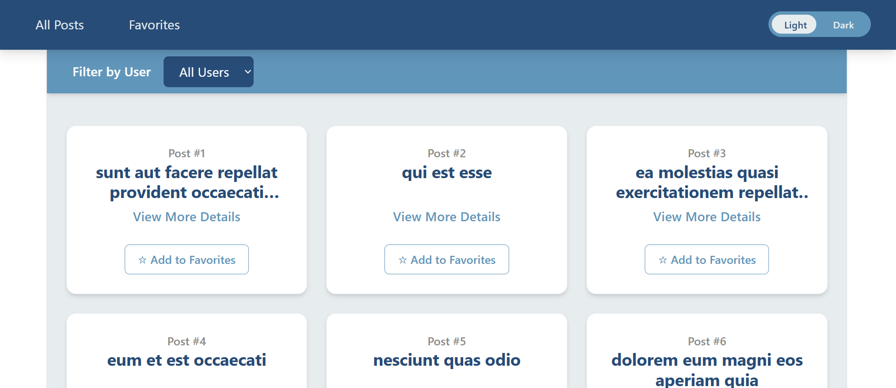
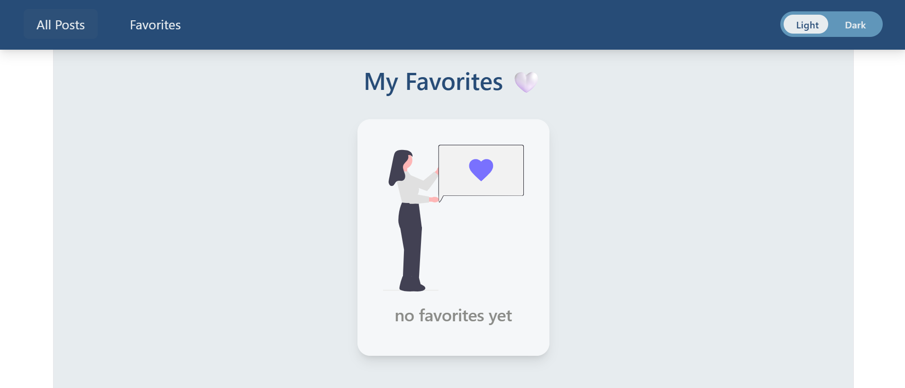
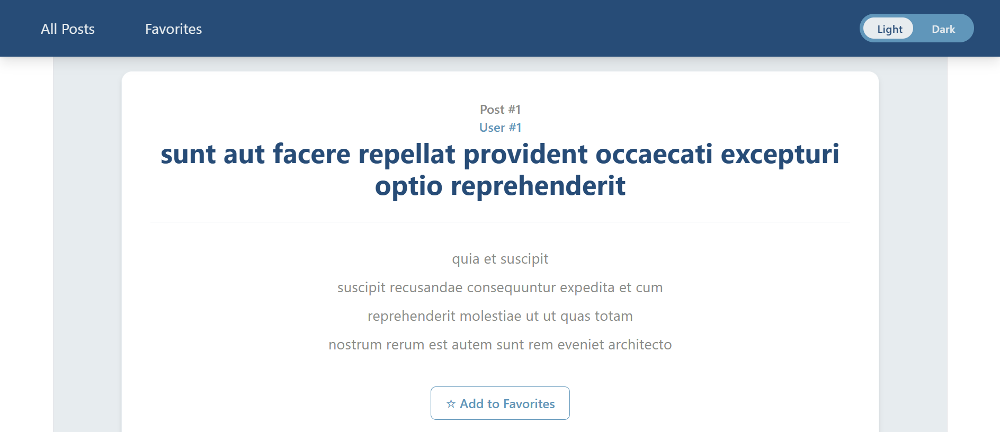

# React Posts App

## 📌 Overview

React Posts App is a responsive single-page application built with React and Vite that consumes data from the JSONPlaceholder API.

The application allows users to browse posts, filter them by user ID, view detailed information, manage a persistent favorites list, and enjoy a modern user experience with loading skeletons, animations, and Dark Mode support.

---

## 🚀 Features

- Fetch posts from the JSONPlaceholder API
- Responsive card-based layout
- Filter posts by User ID
- View full details for every post
- Add and remove favorites
- Favorites persist using localStorage
- Custom `useFetch` hook for data fetching
- Skeleton loading screen while fetching data
- Error handling with retry functionality
- Empty states for missing data and favorites
- Error Boundary for unexpected rendering errors
- Page animations using Framer Motion
- Light and Dark Mode support
- Responsive design for desktop and mobile

---

## 🛠️ Technologies Used

- React
- Vite
- React Router DOM
- Axios
- Tailwind CSS
- Framer Motion
- LocalStorage API
- Vitest
- React Testing Library

---

## 📁 Project Structure

```text
src/
├── components/
│   ├── ErrorBoundary.jsx
│   └── PostCard.jsx
├── hooks/
│   └── useFetch.jsx
├── pages/
│   ├── HomePage.jsx
│   ├── FavoritesPage.jsx
│   └── DetailsPage.jsx
├── services/
│   └── loadingPosts.jsx
├── tests/
│   ├── favorites.test.jsx
│   ├── filter.test.jsx
│   └── useFetch.test.jsx
├── utils/
│   ├── favorites.jsx
│   ├── filter.jsx
│   └── ErrorMessage.jsx
├── App.jsx
└── main.jsx
```

---

## 🔄 Application Flow

1. The application fetches posts from:

```
https://jsonplaceholder.typicode.com/posts
```

2. A custom `useFetch` hook manages:

- Loading state
- Error state
- Retrieved data
- Retry functionality

3. Users can:

- Browse all posts
- Filter posts by User ID
- View detailed information
- Add or remove favorites

4. Favorite posts are stored in localStorage and automatically restored when the application reloads.

---

## 🔄 What changed and why

1. Extracted the data fetching logic into a reusable `useFetch` hook to centralize `data`, `loading`, and `error` state management.

2. Added retry functionality that allows repeating failed API requests without refreshing the entire page.

3. Added an `ErrorBoundary` wrapper to catch unexpected rendering errors and display a fallback UI instead of crashing the application.

4. Added Light/Dark Mode support using theme state, with a toggle button that switches themes without page refresh.

5. Improved API error handling by adding centralized error messages based on the error type and HTTP status code.

   - Added handling for:

     - 404 (resource not found)
     - 500 (server error)
     - Network errors
     - Request timeout errors

6. Improved `useFetch` lifecycle handling by preventing state updates after component unmount using cancellation logic.

7. Added unit tests for the `useFetch` hook using `renderHook` from React Testing Library.

   Tested scenarios:

   - Initial hook state
   - Successful API request
   - Failed API request
   - Retry after a failed request

8. Configured Vitest with `jsdom` environment to support React hook testing with DOM APIs.

---

## ⭐ Favorites

- Add or remove favorites with one click.
- Favorites persist after refreshing the page.
- Dedicated Favorites page.
- Empty state displayed when no favorites exist.

---

## 📄 Pages

### 🏠 Home Page

- Displays all posts
- Filter posts by User ID
- Responsive grid layout
- Skeleton loading state
- Error handling
- Empty data handling

### ❤️ Favorites Page

- Displays saved favorite posts
- Animated empty state
- Remove favorites directly

### 📖 Details Page

- Displays complete post information
- Shows Post ID and User ID
- Add or remove favorites
- Error and loading handling

---

## ⚙️ Custom Hook

### useFetch

A reusable custom hook responsible for:

- Fetching API data
- Managing loading state
- Managing error state
- Providing a retry (`fetchData`) function
- Preventing state updates after component unmount

---

## 🛡️ Error Handling

The project includes:

- Error Boundary to catch unexpected rendering errors
- API error handling with user-friendly messages
- Retry button when data loading fails

Additional improvements:

- Centralized API error message handling.
- Different error types are identified and converted into user-friendly messages.
- Original errors are preserved while displaying readable messages to users.

---

## 🎨 UI & UX

The interface is built with Tailwind CSS and includes:

- Responsive layout
- Fixed navigation bar
- Card-based design
- Hover effects
- Smooth transitions
- Framer Motion animations
- Skeleton loaders
- Empty states
- Light and Dark Mode

---

## 🧪 Testing

Unit tests are written using Vitest.

React hooks are tested using `renderHook` from React Testing Library.

The `useFetch` hook tests cover:

- Initial state
- Successful data loading
- Failed requests
- Retry functionality

API calls are mocked to keep tests isolated and independent from external services.

Run all tests:

```bash
npx vitest
```

Run once:

```bash
npx vitest run
```

---

## ▶️ Running the Project

Install dependencies:

```bash
npm install
```

Start the development server:

```bash
npm run dev
```

---

## 📸 Screenshots

### Home Page



### Favorites Page



### Details Page


